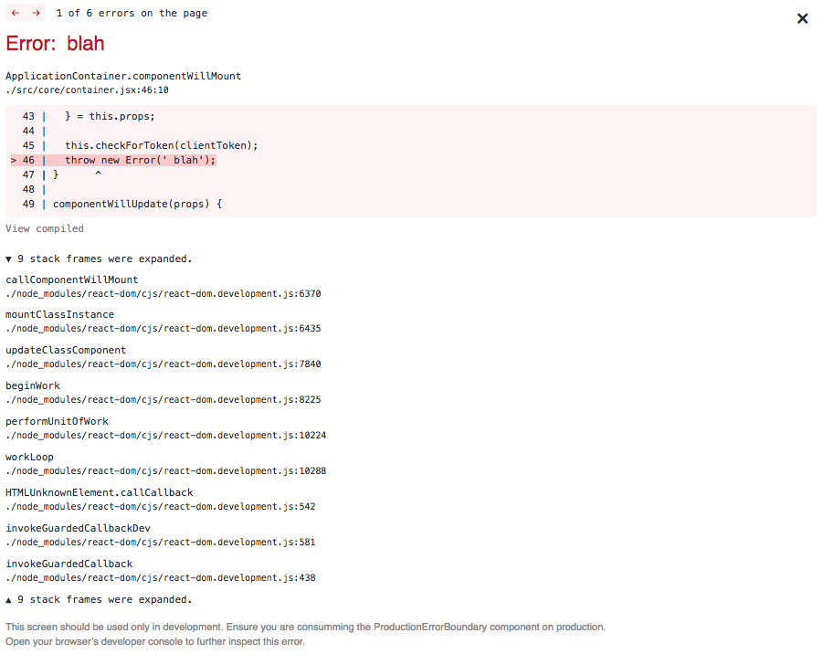
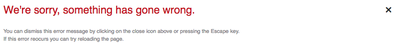
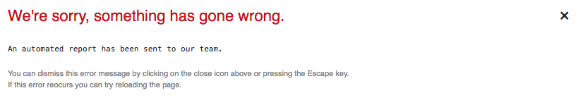

# ⚛️ React Error Guard Component ⚛️

## Setup your consuming project

Firs install the package with `yarn add react-error-guard` (or `npm i --save`). Then you can consume the component like bellow.

```jsx
const MyReactContainer = ({ children }) => {
  let ErrorBoundaryContainer = null;

  if (process.env.NODE_ENV !== 'production') {
    ErrorBoundaryContainer = require('react-error-guard').DeveloperErrorBoundary;
  } else {
    ErrorBoundaryContainer = require('react-error-guard').ProductionErrorBoundary;
  }

  return <ErrorBoundaryContainer>{children}</ErrorBoundaryContainer>;
}
```

ℹ️ Notice: This component right now is only compatible with [React 16](https://reactjs.org/blog/2017/07/26/error-handling-in-react-16.html). But there are plans to support React 15 but much more limited version, `unstable_handleError`.

## `<DeveloperErrorBoundary />`

It is meant to be used as a drop-in helper on development environments. It is a declarative component, abstracted from the [`react-error-overlay`](https://github.com/facebook/create-react-app/tree/next/packages/react-error-overlay). The error screen from the development server from `create-react-app`.

### DeveloperErrorBoundary preview



## `<ProductionErrorBoundary />`

It is meant to be used on production environments, as a helper to provide a fallback error screen and also automated reports to your preferred tool via the `dispatchErrorReporting` prop.

### Customizing `<ProductionErrorBoundary />`

ProductionErrorBoundary is highly customisable through its props.

**Default ProductionErrorBoundary preview (with no `dispatchErrorReporting` provided)**

```jsx
<ProductionErrorBoundary>
  {children}
</ProductionErrorBoundary>
```

The code above will produce the following default error message component render:



**Default ProductionErrorBoundary preview (with `dispatchErrorReporting` provided)**

```jsx
<ProductionErrorBoundary dispatchErrorReporting={dispatchErrorReporting}>
  {children}
</ProductionErrorBoundary>
```

The code above will produce the following default error message component render:



You can even replace the default error message by passing `errorMessageComponent` prop.

```jsx
const ErrorMessageComponent = (
  <div className="error-message">
    <h1>🚨 Whoopsie, we crashed 🚨</h1>
    <p>Don't worry, an automated error report has been sent to our team of cats to handle this.</p>
  </div>
);

const IconClose = <span>❌</span>;

const dispatchErrorReporting = ({ error, info }) => {
  Raven.captureException(error, {
    extra: {
      ...info, reactVersion: React.version
    },
    tags: { version, reactVersion: React.version }
  });
}

const MyReactContainer = ({ children }) => (
  <ProductionErrorBoundary
    errorMessageComponent={ErrorMessageComponent}
    closeIcon={<IconClose />}
    dispatchErrorReporting={dispatchErrorReporting}
  >
    {children}
  </ProductionErrorBoundary>
)
```

▶️ The example above uses [`raven-js`](https://github.com/getsentry/raven-js) but any reporting tool can be used.

🌟 This project started, and still is, an abstraction taken from the amazing works of the [`create-react-app`](https://github.com/facebook/create-react-app/) team.
